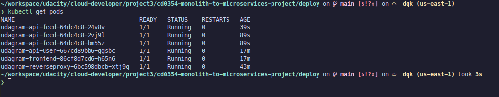

# Screenshots

To help review your infrastructure, please include the following screenshots in this directory::

## Deployment Pipeline

### DockerHub containers


### CircleCI successful build and deploy job


## Kubernetes

* To verify Kubernetes pods are deployed properly

```bash
kubectl get pods
```



* To verify Kubernetes services are properly set up

```bash
kubectl describe services
```


* To verify that you have horizontal scaling set against CPU usage

```bash
kubectl describe hpa
```


* To verify that you have set up logging with a backend application

```bash
kubectl logs {pod_name}
```


